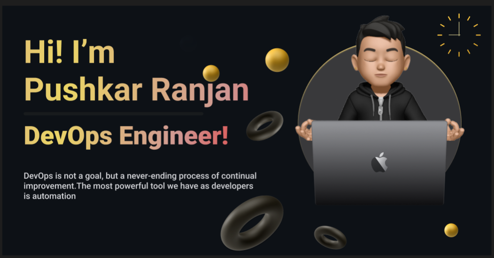

<h1 align="center">Hi 👋, I'm PUSHKAR RANJAN </h1>
<h3 align="center">A passionate DevOps Engineer from India</h3>

<h3 align="left">💫 About Me:</h3>

- 🌱 I'm currently learning **DevOps & AWS Services** 

- 💬 Ask me anything about 'DevOps & AWS Services' 

- 📫 How to reach me **pushkarranjan.2502@gmail.com**

- ⚡ Fun Fact : DevOps is best for automation process!!

<h3 align="left">💻 Tech Stack:</h3>

           

<h3 align="left">✍️ Projects</h3>
  
+ [Parents Communication Through Mobile App](https://github.com/PR-25f/Parents_communication_app.git)
	 A parents communication through mobile app using **JAVA, FIREBASE, XML, ANDROID STUDIO**, offering a **dynamic user experience** with efficient data storage, robust backend services, and responsive frontend interfaces.

+ [Journal-App](https://github.com/PR-25f/Journal-App.git)
	This project is using **JAVA, XML & FIREBASE**, encourages the people to post the photos along with its location and dates allowing the followers to like and do comment.

<h3 align="left">📊 GitHub Stats:</h3>

&nbsp;

